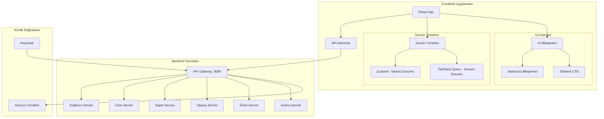
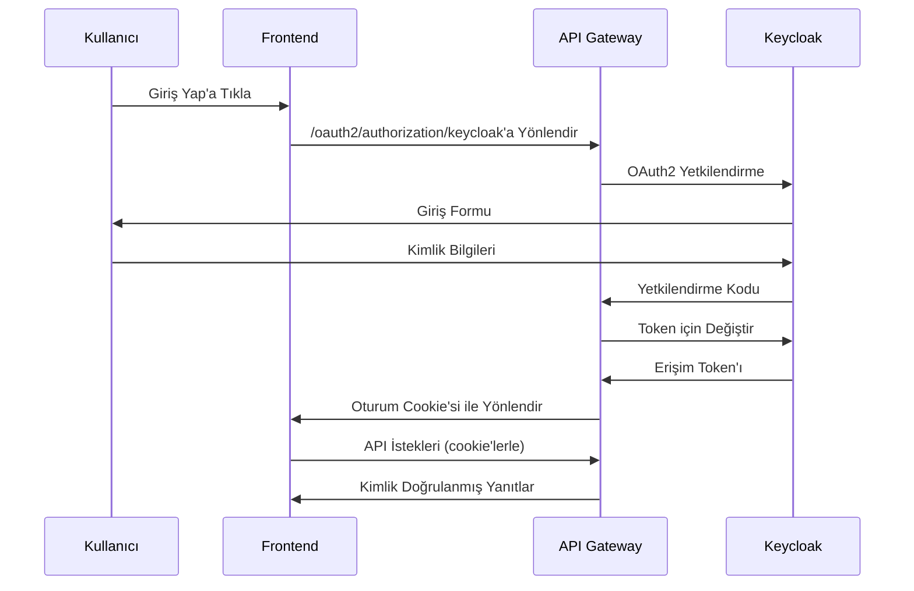
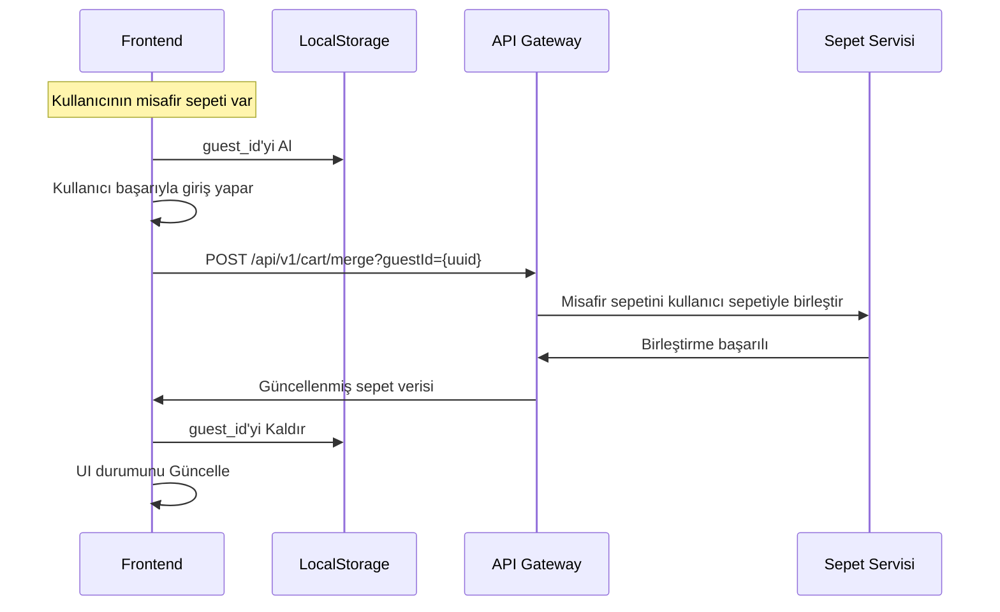

# Tasarım Dökümanı: E-Ticaret Frontend

## Genel Bakış

E-ticaret frontend'i, Backend for Frontend (BFF) desenini uygulayan modern bir React uygulamasıdır. Hem misafir hem de kimlik doğrulanmış kullanıcılar için güvenli oturum yönetimi, gerçek zamanlı sepet senkronizasyonu ve kişiselleştirilmiş önerilerle kesintisiz bir alışveriş deneyimi sağlar.

Uygulama, TypeScript ile React 18+, stillendirme için Tailwind CSS ve bileşenler için shadcn/ui kullanan özellik tabanlı bir mimari takip eder. Durum yönetimi, istemci tarafı durum için Zustand ve sunucu tarafı durum yönetimi için TanStack Query aracılığıyla gerçekleştirilir.

## Mimari

### Üst Düzey Mimari



### Kimlik Doğrulama Akışı



### Misafirden Kullanıcıya Sepet Birleştirme Akışı



## Components and Interfaces

### Core Components

#### 1. Authentication Components
- **LoginButton**: Redirects to Keycloak OAuth2 endpoint
- **UserProfile**: Displays user information and logout functionality
- **ProtectedRoute**: Route wrapper for authenticated-only pages

#### 2. Product Catalog Components
- **ProductGrid**: Displays products in responsive grid layout
- **ProductCard**: Individual product display with image, price, rating
- **ProductDetail**: Detailed product view with specifications and reviews
- **CategoryFilter**: Filter products by category, brand, price range
- **SearchBar**: Auto-complete search with suggestions

#### 3. Shopping Cart Components
- **AddToCartButton**: Adds products to cart with quantity selection
- **CartDrawer**: Slide-out cart summary
- **CartIcon**: Header cart icon with item count badge
- **CartPage**: Full cart management page

#### 4. Layout Components
- **MainLayout**: Primary layout with header, footer, and main content
- **Navbar**: Navigation with search, cart, user menu
- **Footer**: Site links and information
- **LoadingSkeleton**: Skeleton loading states for various components

### API Service Interfaces

#### Authentication Service
```typescript
interface AuthService {
  getCurrentUser(): Promise<User | null>
  logout(): Promise<void>
  checkAuthStatus(): Promise<boolean>
}
```

#### Product Service
```typescript
interface ProductService {
  getFeaturedProducts(): Promise<Product[]>
  getProductById(id: string): Promise<Product>
  searchProducts(query: string, filters?: SearchFilters): Promise<SearchResult>
  getCategories(): Promise<Category[]>
  getBrands(): Promise<Brand[]>
}
```

#### Cart Service
```typescript
interface CartService {
  getCart(): Promise<Cart>
  addToCart(productId: string, quantity: number): Promise<Cart>
  updateCartItem(itemId: string, quantity: number): Promise<Cart>
  removeFromCart(itemId: string): Promise<Cart>
  mergeGuestCart(guestId: string): Promise<Cart>
}
```

#### Order Service
```typescript
interface OrderService {
  createOrder(orderData: CreateOrderRequest): Promise<Order>
  getOrderHistory(): Promise<Order[]>
  getOrderById(id: string): Promise<Order>
}
```

## Data Models

### User Model
```typescript
interface User {
  id: string
  email: string
  firstName: string
  lastName: string
  addresses: Address[]
  preferences: UserPreferences
}

interface Address {
  id: string
  type: 'shipping' | 'billing'
  street: string
  city: string
  state: string
  zipCode: string
  country: string
  isDefault: boolean
}
```

### Product Model
```typescript
interface Product {
  id: string
  name: string
  description: string
  price: number
  discountPrice?: number
  images: ProductImage[]
  category: Category
  brand: Brand
  specifications: ProductSpec[]
  rating: number
  reviewCount: number
  inStock: boolean
  stockQuantity: number
}

interface ProductImage {
  id: string
  url: string
  altText: string
  order: number
}
```

### Cart Model
```typescript
interface Cart {
  id: string
  items: CartItem[]
  totalAmount: number
  itemCount: number
  updatedAt: string
}

interface CartItem {
  id: string
  product: Product
  quantity: number
  unitPrice: number
  totalPrice: number
}
```

### Order Model
```typescript
interface Order {
  id: string
  orderNumber: string
  status: OrderStatus
  items: OrderItem[]
  shippingAddress: Address
  billingAddress: Address
  totalAmount: number
  createdAt: string
  updatedAt: string
}

enum OrderStatus {
  PENDING = 'PENDING',
  CONFIRMED = 'CONFIRMED',
  SHIPPED = 'SHIPPED',
  DELIVERED = 'DELIVERED',
  CANCELLED = 'CANCELLED'
}
```

## Correctness Properties

*A property is a characteristic or behavior that should hold true across all valid executions of a system-essentially, a formal statement about what the system should do. Properties serve as the bridge between human-readable specifications and machine-verifiable correctness guarantees.*

### Property 1: API Request Header Management
*For any* API request, the Frontend should include withCredentials: true globally, and for guest users should inject X-Guest-Id header while authenticated users should not send X-Guest-Id header
**Validates: Requirements 1.2, 4.1, 4.2, 6.2**

### Property 2: API Endpoint Routing
*For any* user action that requires server data, the Frontend should call the correct API endpoint with appropriate parameters
**Validates: Requirements 2.2, 2.3, 3.1, 3.2, 5.2, 5.3, 6.3, 8.3**

### Property 3: Product Display Completeness
*For any* product being displayed, the Frontend should show all required information including images, prices, descriptions, and ratings
**Validates: Requirements 2.4**

### Property 4: Search and Filter Functionality
*For any* search or filter operation, the Frontend should update both URL parameters and displayed results consistently
**Validates: Requirements 2.5, 3.5**

### Property 5: Cart State Synchronization
*For any* cart modification, the Frontend should immediately reflect changes in all UI components and persist state appropriately for user type
**Validates: Requirements 4.3, 4.4, 4.5**

### Property 6: Authentication State Management
*For any* authentication state change, the Frontend should update user-specific content display and handle session management correctly
**Validates: Requirements 1.3, 8.1**

### Property 7: Responsive Design Behavior
*For any* viewport size change, the Frontend should adapt layout and functionality to maintain usability across devices
**Validates: Requirements 7.1**

### Property 8: Loading and Error State Display
*For any* API operation, the Frontend should display appropriate loading states during requests and user-friendly error messages on failures
**Validates: Requirements 7.3, 7.4, 10.1**

### Property 9: Session Expiration Handling
*For any* 401 authentication error, the Frontend should redirect to login only when not on public pages
**Validates: Requirements 10.2**

### Property 10: Request Retry Logic
*For any* failed GET request, the Frontend should implement retry logic before displaying error states
**Validates: Requirements 10.3**

### Property 11: Performance Optimization
*For any* resource loading, the Frontend should implement lazy loading for images and routes, and use caching for server responses
**Validates: Requirements 9.1, 9.2**

### Property 12: Order Processing Flow
*For any* order submission, the Frontend should validate cart contents, collect required information, and handle success/failure states appropriately
**Validates: Requirements 8.4**

### Property 13: Accessibility Compliance
*For any* UI component, the Frontend should maintain WCAG 2.1 AA accessibility standards
**Validates: Requirements 7.5**

## Error Handling

### Error Categories

#### 1. Network Errors
- **Connection Failures**: Display offline message, enable retry
- **Timeout Errors**: Show timeout message with retry option
- **Server Errors (5xx)**: Display generic server error message

#### 2. Authentication Errors
- **401 Unauthorized**: Redirect to login (except on public pages)
- **403 Forbidden**: Display access denied message
- **Session Expiry**: Clear local state and redirect to login

#### 3. Validation Errors
- **400 Bad Request**: Display field-specific validation messages
- **422 Unprocessable Entity**: Show detailed validation errors
- **Form Validation**: Real-time client-side validation

#### 4. Business Logic Errors
- **Out of Stock**: Disable add to cart, show availability message
- **Cart Merge Conflicts**: Prompt user to resolve conflicts
- **Payment Failures**: Display payment-specific error messages

### Error Recovery Strategies

#### Automatic Recovery
- Retry failed GET requests up to 3 times with exponential backoff
- Refresh authentication tokens automatically
- Fallback to cached data when available

#### User-Initiated Recovery
- Manual retry buttons for failed operations
- Clear cache option for persistent issues
- Logout/login cycle for authentication problems

#### Graceful Degradation
- Show popular products when recommendations fail
- Basic search when advanced search is unavailable
- Guest checkout when user service is down

## Testing Strategy

### Dual Testing Approach

The application will use both unit tests and property-based tests to ensure comprehensive coverage:

**Unit Tests**: Verify specific examples, edge cases, and error conditions
- Component rendering with specific props
- User interaction scenarios
- API error handling
- Authentication flow edge cases

**Property Tests**: Verify universal properties across all inputs
- API request header management across all request types
- Product display completeness for any product data
- Cart state synchronization for any cart operations
- Responsive behavior across all viewport sizes

### Property-Based Testing Configuration

- **Testing Library**: fast-check for JavaScript property-based testing
- **Minimum Iterations**: 100 iterations per property test
- **Test Tagging**: Each property test must reference its design document property
- **Tag Format**: `Feature: ecommerce-frontend, Property {number}: {property_text}`

### Testing Tools and Frameworks

#### Core Testing Stack
- **Jest**: Test runner and assertion library
- **React Testing Library**: Component testing utilities
- **fast-check**: Property-based testing library
- **MSW (Mock Service Worker)**: API mocking for tests

#### Specialized Testing
- **Cypress**: End-to-end testing for critical user flows
- **Lighthouse CI**: Performance testing automation
- **axe-core**: Accessibility testing
- **Playwright**: Cross-browser testing

### Test Organization

#### Unit Test Structure
```
src/
├── components/
│   ├── __tests__/
│   │   ├── ProductCard.test.tsx
│   │   └── CartDrawer.test.tsx
├── features/
│   ├── auth/
│   │   └── __tests__/
│   │       └── AuthService.test.ts
└── services/
    └── __tests__/
        └── apiClient.test.ts
```

#### Property Test Structure
```
src/
├── __tests__/
│   ├── properties/
│   │   ├── api-headers.property.test.ts
│   │   ├── cart-synchronization.property.test.ts
│   │   └── responsive-design.property.test.ts
```

### Critical Test Scenarios

#### Authentication Flow Testing
- OAuth2 redirect handling
- Session cookie management
- Guest to authenticated user transition
- Session expiration and renewal

#### Cart Management Testing
- Guest cart creation and persistence
- Cart merge on user login
- Real-time cart updates across components
- Cart persistence across browser sessions

#### API Integration Testing
- Request/response interceptor behavior
- Error handling and retry logic
- CSRF token management
- Header injection based on user state

#### Performance Testing
- Lazy loading implementation
- Cache effectiveness
- Bundle size optimization
- Lighthouse score validation

### Test Data Management

#### Mock Data Strategy
- **Product Data**: Generate realistic product catalogs with varied attributes
- **User Data**: Create test users with different permission levels
- **Cart Data**: Generate carts with various item combinations
- **Order Data**: Create order histories with different statuses

#### Test Environment Setup
- **API Mocking**: Use MSW to mock all backend services
- **Authentication Mocking**: Mock Keycloak OAuth2 flows
- **LocalStorage Mocking**: Test guest user scenarios
- **Network Condition Simulation**: Test offline/slow network scenarios